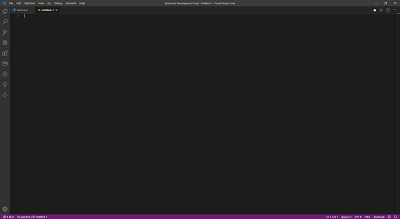

# self-snippets

Common code snippets for front-end development, includes JavaScript (ES6) snippets, Vue snippets and so on.

## Features

This extension adds JavaScript snippets and Vue 2 Code Snippets into Visual Studio Code. in order to improve development efficiency.

## Release Notes

### 0.0.1

Initial release of self-snippets

## Supported languages

* vue(.vue)
* HTML(.html)
* javascript(.js)
